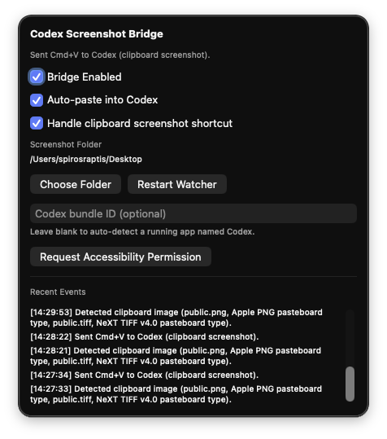

# Codex Screenshot Bridge

Codex Screenshot Bridge is a lightweight macOS menu-bar app that moves screenshots directly into the Codex desktop input box.

It supports both screenshot styles:
- file-based screenshots (saved to disk)
- clipboard-only screenshots (copy shortcut flow)



## Features

- Menu-bar app (`LSUIElement`) with instant enable/disable toggle
- Watches screenshot folder for new files and copies image to clipboard
- Watches clipboard for screenshot image captures
- Optional auto-focus Codex + send `Cmd+V`
- Optional custom Codex bundle ID if app auto-detection is unreliable
- Small in-app event log for troubleshooting

## Requirements

- macOS 13 or newer
- Swift 5.10+ (if running from source)
- Accessibility permission (required only for auto-paste)

## Quick Start (Source)

```bash
swift build
swift run CodexScreenshotBridge
```

Then:
1. Click the menu-bar icon.
2. Enable `Bridge Enabled`.
3. Enable `Auto-paste into Codex`.
4. Enable `Handle clipboard screenshot shortcut` if you use clipboard screenshot shortcuts.

## Package As .app

Use the packaging script:

```bash
./scripts/package_app.sh
```

This creates:
- `~/Applications/CodexScreenshotBridge.app`

## Permissions

For automatic paste (`Cmd+V`) you must allow Accessibility access:

1. Open `System Settings` -> `Privacy & Security` -> `Accessibility`.
2. Enable `CodexScreenshotBridge` (or Terminal/Xcode if running from source).

Without this permission, clipboard copy still works but key injection is blocked by macOS.

## Configuration Notes

- Default screenshot folder is read from `com.apple.screencapture location` and falls back to `~/Desktop`.
- Filename-based detection currently looks for names containing `Screenshot` or `Screen Shot`.
- Clipboard screenshot detection is independent from file watching and works for copy shortcuts.

## Troubleshooting

- Nothing pastes: verify Accessibility permission and keep Codex running.
- App cannot find Codex: set `Codex bundle ID` in the app menu.
- File-based screenshots not detected: set the correct screenshot folder from `Choose Folder`.

## Development

Build:

```bash
swift build
```

Release build:

```bash
swift build -c release
```

## License

MIT. See `LICENSE`.
