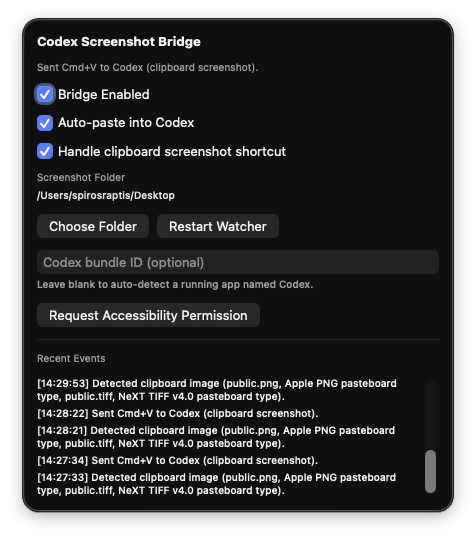

# Codex Screenshot Bridge

Codex Screenshot Bridge is a lightweight macOS menu-bar app that moves screenshots directly into the Codex desktop input box.

It supports both screenshot styles:
- file-based screenshots (saved to disk)
- clipboard-only screenshots (copy shortcut flow)



## Features

- Menu-bar app (`LSUIElement`) with instant enable/disable toggle
- Watches screenshot folder for new files and copies image to clipboard
- Watches clipboard for screenshot image captures
- Optional auto-focus Codex + send `Cmd+V`
- Handles both the fresh-project welcome composer and the normal conversation composer
- Detects the initial Codex screen with a one-shot window snapshot plus OCR of the heading region
- Optional custom Codex bundle ID if app auto-detection is unreliable
- Built-in permission status panel for Accessibility and Screen Recording
- Small in-app event log for troubleshooting

## Requirements

- macOS 13 or newer
- Swift 5.10+ (if running from source)
- Accessibility permission (required only for auto-paste)
- Screen Recording permission if you want the startup-screen detector to identify the initial Codex view reliably

## Quick Start (Source)

```bash
swift build
swift run CodexScreenshotBridge
```

Then:
1. Click the menu-bar icon.
2. Enable `Bridge Enabled`.
3. Enable `Auto-paste into Codex`.
4. Enable `Handle clipboard screenshot shortcut` if you use clipboard screenshot shortcuts.
5. Use the in-app permission actions if Accessibility or Screen Recording is missing.

## Package As .app

Use the packaging script:

```bash
./scripts/package_app.sh
```

This creates:
- `~/Applications/CodexScreenshotBridge.app`

## Permissions

For automatic paste (`Cmd+V`) you must allow Accessibility access:

1. Open `System Settings` -> `Privacy & Security` -> `Accessibility`.
2. Enable `CodexScreenshotBridge` (or Terminal/Xcode if running from source).

Without this permission, clipboard copy still works but key injection is blocked by macOS.

For reliable detection of the initial Codex screen, allow Screen Recording:

1. Open `System Settings` -> `Privacy & Security` -> `Screen Recording`.
2. Enable `CodexScreenshotBridge` (or Terminal/Xcode if running from source).

This is used only to capture a single still image of the Codex window during auto-paste so the app can tell whether Codex is showing the initial centered composer or the normal conversation composer. It is not a continuous recording or video stream.

The menu-bar window also shows the current status for both permissions and includes request/refresh actions for quick troubleshooting.

## Configuration Notes

- Default screenshot folder is read from `com.apple.screencapture location` and falls back to `~/Desktop`.
- Filename-based detection currently looks for names containing `Screenshot` or `Screen Shot`.
- Clipboard screenshot detection is independent from file watching and works for copy shortcuts.

## Troubleshooting

- Nothing pastes: verify Accessibility permission and keep Codex running.
- Initial screen does not paste: verify Screen Recording permission. The startup-screen detector needs one-shot access to the Codex window image.
- Initial screen still misses after permission is granted: make sure you are on a current build from `main`, which detects the centered startup composer before clicking.
- App cannot find Codex: set `Codex bundle ID` in the app menu.
- File-based screenshots not detected: set the correct screenshot folder from `Choose Folder`.

## Development

Build:

```bash
swift build
```

Release build:

```bash
swift build -c release
```

## License

MIT. See `LICENSE`.
